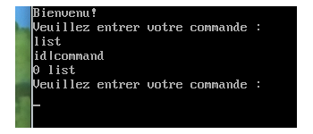

.. footer:: page ###Page###

==============================
Rapport de Projet **Bash** PNL
==============================

--------------------------------------------
PNL -  Programmation au coeur du noyau linux
--------------------------------------------

|
|
|
|

*Ayrault Maxime* **3203694** - *Sivarajah Sivapiryan* **3201389**

|
|
|
|
|
|
|

	   
----------------------------------------------------------

Introduction
============

|
|

|

| Ce document présente le rapport du projet **Bash** de l'UE *PNL*.
| Le projet a pour but de réaliser un invite de commande pour le noyau linux et de le tester
| sur une machine virtuelle. 
| Lors de ce Projet nous nous sommes servis d'une VM *arch linux* en version noyau 4.2.3.
| Nous avons découvert l'utilisation d'*ioctl*, l'intégration d'un module dans un noyau ainsi 
| que l'architecture du noyau.
|

Ce projet se décompose en 2 étapes :

 - L'application utilisateur.
 - Le module noyau.

|

Ce projet a été développé sous git :
 https://github.com/maximouth/pnl_projet

|
|
|
|
|
|
|
|

 

--------------------------------------------

I) Mode d'emploi
================

| 

Pour faciliter la compilation, le transfert et l'initialisation des différents modules et applications, nous avons créé deux petits scripts Bash :

  - upload.sh
  - init.sh

|
|
|
|
| upload.sh sert si l'on a la partition root montée dans le dossier vm_root du répertoire courant

.. code:: sh
   
   #!/bin/bash
   
   rm -f vm_root/projet/our_mod.ko
   
   umount vm_root/
   mount root.img vm_root/
   
   make clean all
   
   cp our_mod.ko vm_root/projet/
   cp our_mod.h  vm_root/projet/
   cp main.c     vm_root/projet/
   cp init.sh    vm_root/
   cp toto.c     vm_root/projet/
   
   sync
   
   ./qemu-run-externKernel.sh
   
|
|

upload.sh permet de :

 - démonter /monter la partition,
 - compiler le module,
 - copier différents fichiers sur la partition,
 - synchroniser pour être sur que tout soit bien écrit
 - lancer la machine virtuelle.

	  
|
|
|
|
|
|
|
|
| init.sh sert une fois la machine virtuelle démarrée

.. code:: sh

  #!/bin/bash
  
  cd projet
  dmesg -C
  
  insmod our_mod.ko
  mknod /dev/hello c 245 0
  
  dmesg
  
  make -f Makefile_app
  gcc -Wall -o toto.x toto.c
  
  ./toto.x &
  
  ps
  
  ./Projet.x /dev/hello
  
|
|

init.sh permet de :

 - nettoyer le dmesg,
 - insérer le module,
 - créer le neud,
 - lancer une petite application (toto.x) en arrière plan 
 - compiler l'application utilisateur et la lancer.

|
|
|
|
|
|
|
|
|
|
|
|
|
|

---------------------------

|
|
|

II) architecture du projet
==========================

|

Notre projet se décompose en 3 parties :

 - le fichier *our_mod.h* contient les différentes structures que nous
   allons utiliser tout au long du projet.
 - le fichier *main.c* correspond à l'application utilisateur qui
   récupère les demandes de l'utilisateur et effectue les appels système.
 - le fichier *our_mod.c* correspond à notre module. Il s'occupe de
   récuperer les appels système **ioctl** et d'effectuer les actions
   correspondantes à ce que l'utilisateur a demandé.

|

III) structures
==============

|
| Pour les appels à **ioctl** nous avons dû créer une structure nous permettant de traiter les différentes
| commandes.   
|

.. code:: c

  struct commande {
    char *nom;
    char **param;
    int asynchrone;
    char *retour;
  };

Notre structure est composée de plusieurs champs :

 - **nom**, qui sert à contenir le nom de la commande.
 - **param**, un tableau de *char**, contenant les differents
   arguments que l'utilisateur peut passer avec la commande.
 - **asynchrone**, qui indique si la commande a été tapée avec un "&"
   à la fin, ce qui permet de la faire s'exécuter en arrière plan.
 - **retour**, qui est un pointeur contenant la chaine de caractère à
   afficher en retour de l'appel systeme.

|
|
|
| Dans le fichier nous avons aussi les ``#define`` des différents numéros de fonction d'appel à **ioctl**.

.. code:: c
  
  #define LIST_IO     10
  #define FG_IOR      11
  #define KILL_IOR    12
  #define WAIT_IOR    13
  #define MEMINFO_IO  14
  #define MODINFO_IOR 15
  

IV) Appli utilisateur
=====================

|

| Notre application utilisateur prend en argument le nom du noeud sur lequel est rataché notre module.
| Elle se lance avec :

.. code:: bash

	  ./Projet.x /dev/xxx

| Et voici ce que nous obtenons en la lançant.
|

.. image:: launch.png
   :scale: 50 %
   :alt: lancement application utilisateur
   :align: center

|

L'utilisateur peut entrer les commandes suivantes qui seront traitées par notre appel système :

 - **list**, qui affiche les processus en cours d'exécution dans le module.
 - **fg <id>**, qui remet en premier plan une application entrain de
   s'executer façon asynchrone.
 - **wait <pid> [<pid>...]**, qui permet d'attendre la fin d'un processus donné
   en argument.
 - **kill <signal> <pid>**, qui permet d'envoyer un signal au processus
   pointé par le pid.
 - **meminfo**, qui affiche l'état actuel de la mémoire.
 - **modinfo <name>**, affiche les différentes informations liées au
   module passé en argument.

|
| Si une autre commande, que celles prevues, est demandée par l'utilisateur ou si il y a une faute de frappe, une
| erreur est retournée et l'utilisateur est invité à lancer une nouvelle commande.
|

------------------------------------

| Dans ce programme, on commence par initialiser la structure commande qui servira tout au
| long de la durée de l'application
| Puis on teste si le noeud existe, si il n'existe pas l'application s'arrête sinon, on ouvre l'entrée
| standard pour pouvoir lire les commandes de l'utilisateur.
| 
| On entre ensuite dans la boucle ``while (1)`` du programme qui est la boucle principale. C'est ici
| qu'on lit les différentes commandes et arguments, et où on fait l'appel à l'ioctl 
|
.. code:: c

   ioctl (module_fd, req, &commande);	  

|
| *module_fd* correspond au descripteur de fichier du noeud ``/dev/xxx``.
| *req* correspond au numéro de la fonction à appeler.
| *&commande* correspond à l'adresse de la structure commande contenant tous les arguments à
| passer à la fonction demandée.

Il y a ensuite l'affichage de la chaine de caractères en retour de l'**ioctl**.

V) Module
=========

|
|

Notre module est découpé en 4 morceaux :
 - **initialisation** du module
 - **destruction** du module
 - la fonction **ioctl**
 - les différentes **fonctions** appelées par l'appel systeme.

Initialisation
&&&&&&&&&&&&&&

|
| Dans l'initialisation nous commençons par trouver un numéro majeur à notre module pour qu'il
| ait une place dans le ``/proc/devices`` qui nous permettera de créer un noeud plus tard avec 
| un ``mknod``

.. code :: c

  major = register_chrdev (0, "our_mod", &fops_mod);

|
| fops_mod contient la liste des appels système que notre module gère et les fonctions associées
| à chaque appel.
| Pour le projet nous n'avons que **ioctl** qui est représenté.

| Pour pouvoir sauvegarder quelle fonction s'exécute et à quel moment, nous avons besoin d'un
| tableau de ``structure commande`` *(voir list)*

| Dans L'initialisation nous continuons par allouer de la mémoire kernel avec des kmalloc 
| pour chaques composant du tableau, nous avons limité le nombre de commandes 
| en simultanées à 10.

|

Destruction
&&&&&&&&&&&

|
| Pour la destruction nous devons retirer notre module des numéros  majeurs de devices afin
| de ne pas saturer la liste.

.. code :: c

  unregister_chrdev (major, "our_mod");

|

| Une fois notre module retiré des numéros majeurs, il faut liberer la mémoire pour éviter
| les fuites mémoire.
| Nous faisons donc des ``kfree`` pour liberer les ressources allouées à notre structure.

|
|
|
|

Ioctl
&&&&&

Notre fonction ``device_ioctl`` est appelée pour chaque appel à ioctl.

| Nous commençons par copier la structure ``commande`` passée en  argument par l'utilisateur,
| vers les adresses adressables coté kernel grâce à la fonction ``copy_from_user``. Nous
| ramenons du côté kernel chaque partie de la structure.
| 
| 
| Nous entrons ensuite dans un switch qui appel la fonction correspondante au numero
| passé en argument. Et renvoi à l'utilisateur la chaine de caractère à afficher grace à la
| fonction ``copy_to_user``.
| Nous liberons enfin le pointeur contenant cette chaine pour éviter les fuites mémoires.
| 
|

Fonctions
&&&&&&&&&
|

List
####

|
| Pour expliquer le fonctionnement de la fonction list nous devons d'abord expliquer la gestion
| de la variale *command_list*.
| Cette variable est déclarée globale et est un tableau de ``struct commande``. Nous avons aussi 
| un compteur global *cmd_cpt* qui sert à connaître le nombre de commande à un temps donné.
|
| A chaque demande de l'utilisateur d'une commande, nous incrémentons le compteur et remplissons la
| première case libre du tableau avec les informations de cette structure.
| 
.. code:: c

  strcpy (command_list[cmd_cpt].nom , args->nom);
  i = 0;
  
  while (i < 10) {
    if (args->param[i] != NULL) { 
      strcpy (command_list[cmd_cpt].param[i] , args->param[i]);
    }
    i ++;
  }

| Une fois la commande traitée nous décrementons le compteur.
| 
| De cette façon, pour afficher les différentes commandes s'éxecutant à  un moment donné, nous
| parcourons simplement le tableau jusqu'à la case numero *cpt_cmd-1*, en affichant le numero
| **ID** de la tache et le **nom** de cette tâche.

|
|

Fg 
###

|
pas fait encore
|

Wait
####

|
pas fait encore
|

Kill
####

|

| Cette fonction sert à pouvoir envoyer un signal à un processus designé par son **pid**.
| Nous récupérons le numero du signal à envoyer et le pid dans la structure commande copié dans l'**ioctl**

| Avant de pouvoir envoyer un signal à un processus nous devons dabord commencer par verifier si
| le processus corespondant existe. Nous le faisons grâce à la fonction find_vpid() qui nous renvois un
| pointeur sur la structure **pid** correspondant au processus qui à le pid passé en argument.
| 
| Si le pointeur est ``NULL``, nous retournons que le pid n'existe pas.
| 
| Si il existe nous envoyons le signal au processus demandé avec la fonction ``kill_pid`` et nous
| testons sa valeur de retour. Si c'est réussit nous renvoyons un aquittement de la demande, sinon
| nous signalons que l'envois du signap à raté.

image?

|

Modinfo
#######

|

Meminfo
#######

|
|

Gestion synchrone/asynchrone
&&&&&&&&&&&&&&&&&&&&&&&&&&&&

|

explication des workqueue/waitqueue

|

------------------------------------------
   
VI) Conclusion
==============    

| Les 3 fichiers de notre projet ne remontent pas d'erreurs lorqu'ils passent le **checkpath**. Notre
| module réalise bien toutes les fonctions attendues de façon synchrone ou asynchrone qui
| retournent les informations  attendues.
| Nous avons limité volontairement le nombre de paramètres  à 10 afin de nous focaliser davantage 
| sur les fonctions  à écrire. 
|

.. image:: trame.png
   :scale: 250 %
   :alt: trame protocale DCC
   :align: center

.. code:: VHDL

rajouter que le nombre de param est limité à 10.	  
